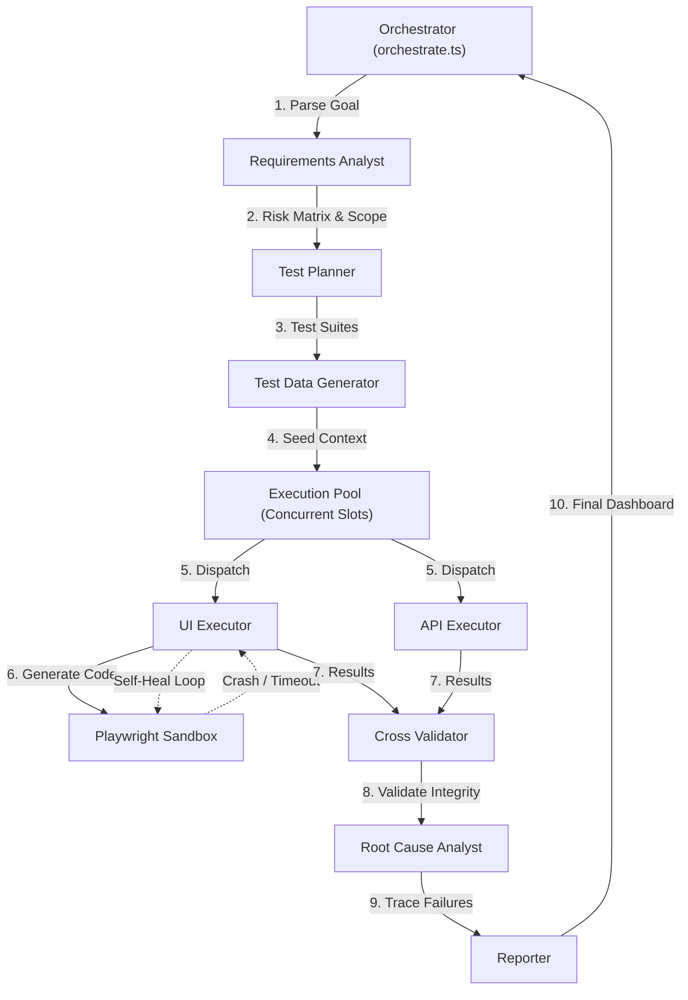

# Advanced Multi-Agent SDLC Test Automation Framework

This project orchestrates 9 specialized AI agents executing the full software testing lifecycle using Groq (Llama 3.3/3.1), Playwright, and native REST execution.

## Architecture Flow



## Folder Structure

- `/agents` - Contains the TypeScript execution logic and dynamic Playwright Sandbox environments for all 9 specialized agents.
- `/prompts` - Contains the markdown-based system prompts that define the constraints and capabilities of each agent.
- `/core` - Core orchestration engine, including the `GroqClient` with a 12-model rate-limit fallback cascade, `logger`, and `tokenBudget`.
- `/schemas` - TypeScript interfaces and Zod schemas used to enforce structured JSON outputs from the LLMs.
- `/reports` - Directory where the `Reporter` agent writes the final `report.json` and `summary.html` dashboards, and where transpiled Playwright `.spec.ts` scripts are saved.
- `orchestrate.ts` - The primary entry point that boots the pipeline and manages the state context.

## Install Steps
1. `npm install`
2. Ensure you have the `.env` configured with `GROQ_API_KEY`.

## How to Run
```bash
npm start
```

## Adding a New Agent (3 Steps)
1. **Create the Prompt**: Add `newAgent.md` in `/prompts`.
2. **Create the Logic**: Add `newAgent.ts` in `/agents`. Ensure it registers itself via `registerAgent("newAgent", "...", new NewAgentClass())`.
3. **Import**: Import it inside `orchestrate.ts` to execute its hook in the SDLC.
